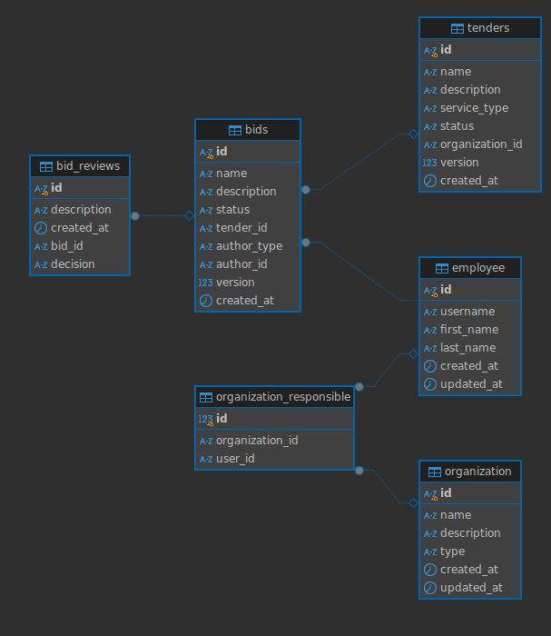

# README

## Предисловие

Писал работу в последние часы (у меня на Ubuntu сломался Xorg), поэтому какие-то API, как правило это последние в каждой группе, реализовать не успел.

Важный момент который хочу уточнить - я так и не понял надо ли что-то делать с кубернетисом и о каких командах шла речь в README из корня. Задал вопрос на почту техподдержки, но мне не отвтеили, поэтому сделал без кубернетиса.

---

## Docker

Go сервис и сервер PSQL завернуты каждый в свой докер контейнер - поднял и забыл. Порт для API соблюдён, можно дергать за ручки хоть курлом, хоть сваггером иди инсомнией.

Команда для поднятия (запускается из директории с docker-compose.yml)

```jsx
docker-compose up --build
```

После запуска вас могут начать пугать невозможностью Go приложения прочитать таблицы БД, но это временная проблема пока не подтянется init.sql. В остальном проблем нет

---

## PSQL



Схема БД

Для создания БД я воспользовался предоставленными в **задание/README.md** DML кодами для отношения employee/organization/o_r, но я их немного подрихтовал. Я заменил тип данных у **id** на VARCHAR(100), так как в openapi.yaml id пользователей и компаний это всегда строки, а не целочисленные значения.

Остальные отношения я строил по openapi.yaml, они были представлены в списке схем. Из моих изменений тут было лишь добавление атрибута decision в отношение bid_reviews. Этот атрибут был перечислен в этом списке, однако ни в одной таблице я его не нашел. 

Добавил я его именно сюда, так как мне показалось, что логичнее всего, наприме, отказаться от проекта с указанием причины. На уровне **bids** это сделать не получится, без изменения DDL, так как атрибут description отвечает за описание бида. В то время как в таблице **bid_reviews** в тамошнем description можно поминутно расписать где и как организации не понравился бид и поставить оценку, коих тут две - принято/не принято.

Также у меня возникли некоторые непонятки с пользователями создавшими тендер. В соответствующей таблице хранится лишь идентификатор организации, создавшей тендер, а не пользователся. Поэтому я принял решение, что **каждый работник компании-создателя может читать информацию о “собственных” тендера.**

---

## Go

API я писал с применением gin-goinc’а, к БД ходил через GORM, поэтому сегодня без sql-инъекций.

В проекте, глобально, имеется лишь 3 модели данных: тендеры, биды, пользователи. 

Пробовал так или иначе оптимизировать написание кода, например вынесением возврата http.Response в отдельный метод, или обращением почти всех (реализованных) бид апишке через один и тот же метод. 

Соединение с БД устанавливается единожды в начале работы сервиса и, просто как переменная, передается в каждый отдельный метод, которому надо сходить к БД. Это нужно чтобы каждый раз не устанавливать соединение, что является достаточно трудоёмким процессом.

## Структура проекта
В данном проекте находится типой пример для сборки приложения в докере из находящящегося в проекте Dockerfile. Пример на Gradle используется исключительно в качестве примера, вы можете переписать проект как вам хочется, главное, что бы Dockerfile находился в корне проекта и приложение отвечало по порту 8080. Других требований нет.

## Задание
В папке "задание" размещена задча.

## Сбор и развертывание приложения
Приложение должно отвечать по порту `8080` (жестко задано в настройках деплоя). После деплоя оно будет доступно по адресу: `https://<имя_проекта>-<уникальный_идентификатор_группы_группы>.avito2024.codenrock.com`

Пример: Для кода из репозитория `/avito2024/cnrprod-team-27437/task1` сформируются домен

```
task1-5447.avito2024.codenrock.com
```

**Для удобства домен указывается в логе сборки**

Логи сборки проекта находятся на вкладке **CI/CD** -> **Jobs**.

Ссылка на собранный проект находится на вкладке **Deployments** -> **Environment**. Вы можете сразу открыть URL по кнопке "Open".

## Доступ к сервисам

### Kubernetes  
На вашу команду выделен kubernetes namespace. Для подключения к нему используйте утилиту `kubectl` и `*.kube.config` файл, который вам выдадут организаторы.

Состояние namespace, работающие pods и логи приложений можно посмотреть по адресу [https://dashboard.avito2024.codenrock.com/](https://dashboard.avito2024.codenrock.com/). Для открытия дашборда необходимо выбрать авторизацию через Kubeconfig и указать путь до выданного вам `*.kube.config` файла

